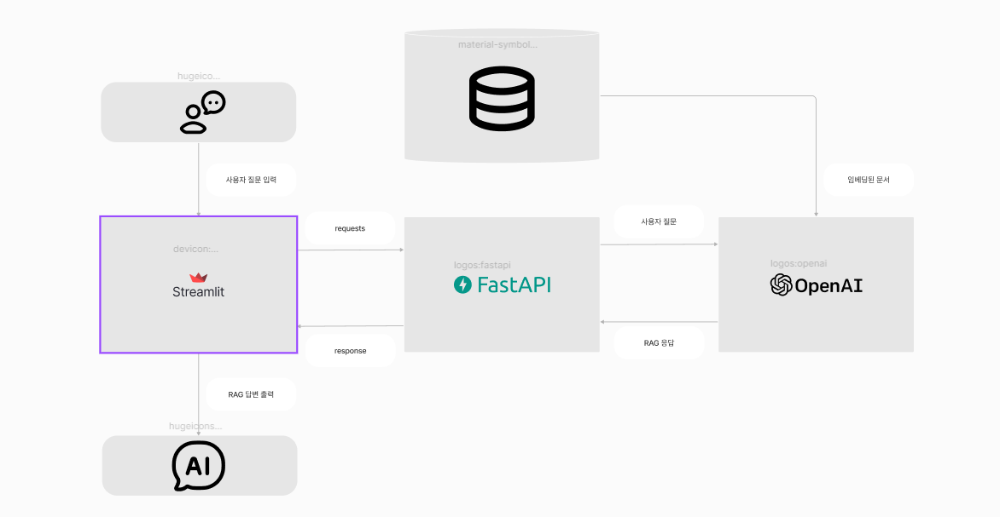

 # Group 10

<!-- ## 1. 답변을 어떻게 해야 하는지에 대한 prompt 설정

## 2. 질문과 함께 자료로 넣어 줄 csv 파일

## 3. 1, 2번의 자료들로 답변을 얻을 RAG 모델 설정
- 윤수용 : 프로토 타입 답변을 제공하는 RAG 모델 시연

## 4. 와이어 프레임 작성
1. 홈 화면 (Home Screen)
1.1. 상단 바 (Header Bar)
    로고: 챗봇 서비스나 브랜드의 로고.
    챗봇 이름: 챗봇의 이름을 표시하여 사용자에게 어떤 서비스인지 명확히 전달.
    설정 아이콘: 사용자 설정, 언어 변경, 알림 설정 등에 접근할 수 있는 버튼.
    검색 버튼: 사용자가 원하는 정보를 바로 찾을 수 있도록 돕는 검색 기능.
    사용자 프로필 아이콘: 사용자 계정 정보나 로그인 상태 표시.
1.2. 메인 대화 영역 (Main Chat Area)
    대화 창:
    사용자가 주고받은 메시지가 표시되는 스크롤 가능한 공간.
    메시지는 사용자의 메시지와 챗봇의 응답으로 구분되어 표시.
    타임스탬프: 각 메시지 옆에 전송 시간 표시 (선택 사항).
    사용자 메시지: 왼쪽에 사용자가 입력한 텍스트, 이미지, 파일 등의 메시지 표시.
    챗봇 메시지: 오른쪽에 챗봇이 응답하는 텍스트, 이미지, 카드 형식의 메시지 표시.
    텍스트, 이미지, 비디오, 버튼 등의 다양한 응답 형식 제공.
1.3. 입력 영역 (Input Area)
    텍스트 입력 필드: 사용자가 메시지를 입력할 수 있는 공간.
    음성 입력 버튼: 사용자가 음성으로 메시지를 입력할 수 있는 버튼.
    첨부 파일 버튼: 사진, 파일, 위치 등의 첨부가 가능하도록 하는 버튼.
    전송 버튼: 메시지를 전송하는 버튼 (일반적으로 종이비행기 아이콘).
    메시지 예시 버튼: 사용자가 자주 묻는 질문에 대해 빠르게 답변을 받을 수 있도록 하는 예시 버튼 (예: "날씨", "교통", "뉴스").

2. 대화 흐름 (Dialogue Flow)
    2.1. 대화 시작 시나리오 (Initial Conversation Flow)
    인사 메시지: 챗봇이 사용자에게 인사를 건넴 ("안녕하세요! 무엇을 도와드릴까요?").
    주요 메뉴/옵션 제공: 사용자가 선택할 수 있는 옵션을 버튼 형태로 제공 (예: "날씨 확인", "최근 뉴스 보기", "계산기").
    상호작용 방식:
    버튼을 클릭하거나, 사용자가 텍스트로 직접 질문을 입력할 수 있도록 유도.
    2.2. 단계별 대화 흐름 (Step-by-Step Interaction)
    단계 1: 사용자가 원하는 옵션을 선택.
    예: "날씨 확인"을 선택하거나 "서울 날씨 알려줘"라고 텍스트 입력.
    단계 2: 챗봇이 선택된 옵션에 맞는 정보를 제공.
    예: "서울의 오늘 날씨는 맑고 기온은 25도입니다."
    단계 3: 추가적인 옵션이나 질문을 제공.
    예: "다른 지역 날씨를 확인하시겠어요?", "다시 시작하기" 등.
    2.3. 다양한 대화 형태 (Flexible Dialogue Forms)
    버튼 응답: 사용자 선택을 유도하는 버튼 제공 (예: "네", "아니오", "다시 시도").
    자연어 응답: 사용자 입력에 따라 챗봇이 자연스러운 언어로 응답.
    확인 대화: 사용자의 입력을 확인하는 메시지 (예: "서울 날씨를 확인해도 될까요?").
    2.4. 예외 처리 대화 흐름 (Error Handling)
    알 수 없는 입력: 사용자가 이해할 수 없는 입력을 했을 때, 챗봇은 "죄송합니다, 이해할 수 없습니다. 다른 방법으로 질문해 주세요."라고 안내.
    실패 시나리오: 예를 들어 API 오류나 서비스 불가 시 "현재 서비스가 중단되었습니다. 잠시 후 다시 시도해주세요." 등의 안내 메시지 표시.

3. 사용자 상호작용 (User Interaction)
    3.1. 메시지 반응 시간 (Response Time)
    로딩 스피너: 챗봇이 응답하는 동안 로딩 아이콘이나 스피너 표시.
    응답 시간 안내: 응답을 받기까지 예상 시간을 알려주는 메시지 (선택 사항).
    3.2. 사용자 맞춤형 기능 (Personalized Features)
    사용자 이름 호출: 사용자가 로그인 상태일 경우, 챗봇이 "안녕하세요, [사용자 이름]님!"으로 인사.
    위치 기반 서비스: 사용자의 위치 정보를 기반으로 날씨, 교통 등의 맞춤형 정보를 제공.
    사용자 학습: 사용자의 이전 대화 이력을 바탕으로 점차 개선된 대화 제공.

4. 기능별 화면 (Feature-specific Screens)
    4.1. 날씨 확인 화면
    날씨 정보 카드: 오늘의 날씨, 기온, 습도, 바람 속도 등을 카드 형식으로 제공.
    주간 날씨 예보: 주간 날씨 예보를 스와이프하여 확인할 수 있는 화면.
    다른 도시 날씨: 다른 도시의 날씨를 확인할 수 있는 선택 옵션 제공.
    4.2. 뉴스 확인 화면
    뉴스 카드: 최신 뉴스 기사를 카드 형식으로 제공.
    카테고리 선택: 정치, 경제, 스포츠 등 카테고리를 선택할 수 있는 기능.
    기사 공유 버튼: 사용자가 기사나 정보를 다른 사람과 공유할 수 있는 버튼.
    4.3. 계산기 화면
    계산기 인터페이스: 숫자 입력과 계산을 위한 간단한 인터페이스 제공.
    계산 결과: 계산 결과를 실시간으로 화면에 표시.

5. 설정 화면 (Settings Screen)
    5.1. 언어 설정
    언어 선택 버튼: 다국어 지원을 위해 다양한 언어를 선택할 수 있는 옵션 제공 (예: 한국어, 영어, 일본어 등).
    5.2. 알림 설정
    알림 스위치: 사용자가 알림을 켜거나 끌 수 있는 토글 스위치.
    알림 유형: 알림의 유형(예: 새로운 메시지 알림, 이벤트 알림 등) 선택.
    5.3. 개인 정보 설정
    사용자 프로필: 사용자가 이름, 이메일 등을 수정할 수 있는 화면.
    로그아웃: 사용자가 로그아웃할 수 있는 버튼.

6. 피드백 및 평가 (Feedback and Rating)
    피드백 요청: 대화가 끝난 후, 챗봇이 사용자에게 피드백을 요청 ("챗봇 사용에 대한 피드백을 남겨주세요").
    평점 시스템: 별점으로 서비스 만족도를 평가할 수 있는 시스템.
    피드백 수집: 사용자가 피드백을 남기거나 제안 사항을 입력할 수 있는 공간.

7. 시스템 및 오류 처리 (System and Error Handling)
    7.1. 서비스 불가 화면
    서비스 점검: "현재 서비스 점검 중입니다. 잠시 후 다시 시도해주세요." 등의 메시지.
    7.2. 네트워크 오류
    네트워크 문제: 네트워크 연결 문제 시 "인터넷 연결이 불안정합니다. 다시 시도해주세요." 메시지 표시. -->
 


# **창업 사업 기획서 챗봇 (사업아이템 및 투자전략 지원)**

---

## 📌 프로젝트 소개  
**창업 아이디어 및 사업계획서 작성 과정을 지원하는 AI 기반 챗봇**입니다.  
사용자가 입력한 데이터를 기반으로 투자 전략, 시장 분석, 고객 페르소나 등 사업계획서 작성의 핵심 섹션을 자동화합니다.  

---

## 🎯 프로젝트 핵심 목표  

1. **창업 과정의 효율성 향상**  
   - 사업계획서 작성 및 분석 과정을 자동화하여 시간과 비용 절감  
2. **사용자 중심의 대화형 인터페이스 제공**  
   - 창업 아이디어, 타겟 고객, 시장 분석 등 대화형으로 필요한 정보를 제공  
3. **결과물 저장 및 활용 기능 강화**  
   - 생성된 분석 데이터를 텍스트(CSV, PDF) 파일로 다운로드 가능

---

## 🌟 Key Summary  

### ✅ **가장 돋보이는 성과**  
1. **임베딩 기반 데이터 검색**: 대규모 창업 데이터를 효율적으로 활용한 결과 생성 
2. **FastAPI와 LLM 통합**: 실시간으로 창업 아이디어에 대해 맞춤형 분석 결과를 제공 
3. **Streamlit 기반 UI 설계 및 DB 운용**: 사용자 친화적인 인터페이스를 제공하고, 대화 내역을 DB에 저장하여 키워드 검색 기능 제공

---

## 🏗️ 인프라 아키텍처 & 적용 기술  

## 시스템 개요



---

## 시스템 실행 방법
### 1. front.py와 server.py를 각각 실행하는 경우 (이 방법을 권장)
   1) 터미널을 2개로 분할, 혹은 2개의 터미널을 띄운다.
   2) 한 쪽 터미널에 아래의 명령어를 입력한다.
      ```bash
      uvicorn server:app --reload
      ```
   3) 나머지 터미널에 아래의 명령어를 입력한다.
      ```bash
      streamlit run front.py
      ```
   4) 시스템을 종료하려면 각 터미널에 `ctrl+c`를 누른다.

### 2. run.py를 실행하는 경우
   1) 터미널에 아래의 명령어를 입력한다.
      ```bash
      python run.py
      ```
   2) 시스템을 종료하려면 터미널에 `ctrl+c`를 누른다.

---

## 채팅 시나리오

다음은 프로그램이 정상적으로 동작하는 것을 보여줄 수 있는 채팅 메시지 예시입니다.

### 사용자:  
"제주도에서 창업하려고 하는데, 유망한 시장이 무엇인지 알려주세요."

### AI 챗봇:  
"안녕하세요! 제주도 창업 지원 AI입니다. 다음은 제주도에서 유망한 시장입니다:  
1. 관광 및 문화 체험 산업  
2. 친환경 농업 및 식품 제조  
3. 디지털 노마드 공간 제공  

더 자세히 알고 싶으신 시장이 있나요?"

---

### 사용자:  
"관광 산업과 관련된 데이터를 분석해줘."

### AI 챗봇:  
"다음은 제주도 관광 산업 관련 주요 데이터입니다:  
- **관광객 수 변화 추이**: 연평균 12% 증가  
- **주요 관광객 출처**: 국내 85%, 해외 15%  
- **핵심 트렌드**: 체험형 관광, 로컬 푸드 중심 관광  

이 데이터로 어떤 분석이 필요하신가요?"


### 참고: [시연 영상](https://youtu.be/cKqVmrOtqaE)📹
---

## ⚙️ 주요 기능

1. **대화형 인터페이스**
    - 사용자가 창업 아이디어를 입력하면 실시간으로 피드백 제공.
    - **예시 질문**:
      - "고객 타겟팅을 어떻게 설정하면 좋을까?"
      - "내 시장 규모를 분석해줘"

2. **섹션별 결과 생성**
    - 고객 현황 분석, 시장 규모 평가 등 창업에 필요한 주요 데이터를 분석

---

## 🛠️ 기술적 고도화

<details>
<summary><strong>[성과 및 기술적 깊이: 고객 페르소나 분석]<strong></summary>

### **[배경 및 요구사항]**
1. **배경**: 창업 초기 단계에서 타겟 고객을 명확히 설정하는 것이 성공의 핵심
2. **요구사항**: 입력 데이터를 분석하여 연령, 관심사, 주요 니즈 등의 고객들을 파악

### **[구현한 기능]**
- 고객 데이터를 분석하고 타겟 고객의 특징을 도출하는 기능

### **[주요 로직]**
- LangChain 기반의 LLM과 데이터 임베딩 기술을 사용하여 입력된 데이터를 분석
- 데이터를 토큰화하고 주요 패턴을 시각화하여 사용자에게 제공

### **[의사결정 및 성과]**
- **기술 도입**: Langchain을 사용하여 빠르고 정확한 데이터 처리
- **결과**: 고객 맞춤 텍스트가 생성 정확도가 개선됨

</details>

<details>
<summary><strong>[성과 및 기술적 깊이: 시장 규모 분석]<strong></summary>

### **[문제 정의]**
- 시장 규모를 추정할 때 데이터를 체계적으로 정리하고 제공하는 기능이 부족

### **[해결 과정]**
1. **임베딩 기반 데이터 검색**: 관련 데이터베이스에서 정확한 시장 데이터를 추출.
2. **FastAPI와 통합**: 실시간 응답 속도를 유지하면서 대량 데이터를 처리

### **[결과]**
- 분석 결과 응답 시간 단축
- 시장 규모 추정 정확도 상승

</details>

---

## 🤝 역할 분담 및 협업 방식

| 역할          | 담당자         | 주요 업무                              |
|---------------|---------------|---------------------------------------|
| **팀장**      | 윤수용         | 자료 크롤링, FastAPI 설계 및 시스템 통합 |
| **데이터 처리** | 이형민, 정석훈 | 자료 임베딩, 데이터 전처리, RAG 모델 설계 |
| **UI 개발**    | 이지훈         | Streamlit UI 설계, 발표자료 제작        |

---

## 📈 성과 및 회고

### **성과**
1. 창업 관련 챗봇으로서 데이터 기반 분석 결과 제공.
2. 시장 분석 및 고객 분석 기능으로 **사용자 신뢰도 향상**

### **회고 및 향후 계획**
- **잘된 점**: FastAPI와 Streamlit의 통합으로 빠르고 직관적인 시스템 완성
- **아쉬운 점**: 핵심 목표였던 분석 결과를 텍스트 파일로 다운로드 기능 구현하지 못함
- **향후 계획**: 시장 매출 분석 데이터를 확장, 모델 정교화를 통해 성능 개선

---

## 🔧 기술 스택

| 기술         | 상세 내용              |
|--------------|-----------------------|
| **언어**     | Python               |
| **라이브러리** | Streamlit, LangChain, Pandas |
| **프레임워크** | FastAPI             |
| **버전 관리** | Git, GitHub          |

---

---


## 🛠️ 트러블 슈팅

### 1. 공공데이터 사용이슈

- **문제**: 공공데이터(카드매출현황,점포수 현황) csv파일 데이터 전처리 과정에서 과부화
- **해결 방법**: 청크 과정으로 해결하려고 했으나 해결하지 못함

### 2. **데이터 처리 지연**

- **문제**: 대량 데이터 처리 시 응답 시간이 느려짐.
- **해결 방법**: LangChain에서 임베딩 효율을 높이고 FastAPI 비동기 요청 처리로 속도 최적화.

### 3. 이전 대화 기억하기

- **문제**: 챗봇이 이전 대화를 기억하지 못해 점진적인 문답을 할 수 없었음
- **해결 방법**: 질문을 챗봇에게 넘겨줄 때, 가장 최근의 대화 내역을 포함(최대 20개) 하여 넘겨줌

### 4. 채팅 히스토리 관리

- **문제**: 프로그램이 실행되는 동안 동일한 URL로 접속하면 타인이 내 대화 내역을 볼 수 있었음
- **해결 방법**: 세션 상태에 ID를 부여하여 ID가 다르면 채팅 히스토리를 볼 수 없도록 조치함

---

# 기술 비교표

---

## 모델 비교: OpenAI vs Gemini vs Claude

| **항목**           | **OpenAI GPT**               | **Google Gemini**                  | **Anthropic Claude**             |
|---------------------|------------------------------|-----------------------------------|-----------------------------------|
| **성능**           | 높은 언어 이해 및 생성 능력  | 뛰어난 언어 이해 및 멀티태스킹   | 자연스럽고 윤리적인 대화 최적화  |
| **가격**           | GPT-3.5 저렴, GPT-4 고가    | 상용화 초기, 가격 정보 제한적    | 비용이 낮고 제한된 사용량에 적합 |
| **지원 커뮤니티**   | 방대한 사용자 및 문서 지원   | 초기 단계, Google 중심 커뮤니티  | 상대적으로 작은 커뮤니티         |
| **1M 토큰 당 가격** | Input: \$5 / Ouput: \$15  | Input: \$3.5 / Ouput: \$10.5 | Input: \$15 / Ouput: \$75 |
| **MATH Benchmark** | 76.60%  | 67.70% | 71.10% |

### 선택한 모델과 선택 이유
- 모델: OpenAI GPT
- 이유: 자료를 보고 산출하는 역할도 수행해야 하기 때문에 MATH Benchmark 점수가 가장 높은 OpenAI GPT를 선택함
> [LLM 성능 비교](https://www.vellum.ai/llm-leaderboard)

---

## 백엔드 비교: FastAPI vs Django

| **항목**           | **FastAPI**                  | **Django**                       |
|---------------------|------------------------------|-----------------------------------|
| **경량성**         | 경량, 비동기 지원으로 빠름    | 완전한 기능 제공, 다소 무거움    |
| **문서화**         | 자동화된 문서 생성 지원       | 내장 문서화 지원 부족            |
| **유연성**         | 비동기 요청 처리 및 확장 가능 | 내장 ORM 및 기능으로 제약 있음   |
| **사용 사례**      | API 중심 경량 애플리케이션    | 대규모 애플리케이션 또는 웹사이트 |

### 선택한 백엔드와 선택 이유
- 백엔드: FastAPI
- 이유: 사용하기 간편하면서 빠른 프로그램을 원했기 때문에 FastAPI를 선택함

---

## 프론트엔드 비교: Streamlit vs Gradio

| **항목**           | **Streamlit**                | **Gradio**                       |
|---------------------|------------------------------|-----------------------------------|
| **개발 속도**       | 빠르고 간단한 대화형 UI 구축 | 빠른 인터페이스 생성 지원         |
| **사용성**         | 데이터 분석 및 대화형 시각화  | 머신러닝 모델 데모에 최적화      |
| **배포 용이성**    | Python 환경에서 쉽게 통합 가능 | 단순한 데모 중심으로 적합         |
| **사용 사례**      | 데이터 대화형 대시보드 및 챗봇 | ML 모델 시연 및 간단한 인터페이스 |

### 선택한 프론트엔드와 선택 이유
- 프론트엔드: Streamlit
- 이유: 더 많은 사용자 인터페이스 커스터마이징을 제공하기 때문에 streamlit을 선택함

---

## 프레임워크 비교: LangChain vs LlamaIndex

| **항목**           | **LangChain**                | **LlamaIndex**                   |
|---------------------|------------------------------|-----------------------------------|
| **유연성**         | 다양한 데이터 소스와 통합 가능 | 문서 중심 검색 및 요약에 강점     |
| **확장성**         | RAG, 임베딩 등 다양한 기능 지원| 단순한 검색 및 임베딩에 초점      |
| **성능**           | 복잡한 워크플로에 적합        | 간단한 데이터 처리에 적합         |
| **사용 사례**      | 대규모 데이터 분석 및 응용     | 문서 검색, 간단한 응답 생성       |

### 선택한 프레임워크와 선택 이유
- 프레임워크: LangChain
- 이유: 인터페이스가 간편하고, 풍부한 예제 및 참고 자료가 많아 프로젝트에 적용하기 더 수월할 것이라 생각함

---

## 📂 결과물

- **사용자 인터페이스**: Streamlit 기반 대화형 챗봇
